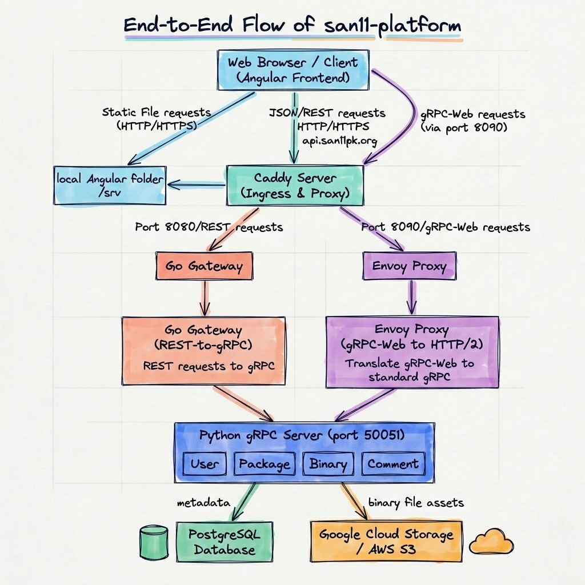

# [san11-platform](https://san11pk.org)
A web platform to share San11 related tools



# Usage

## Prepare VM environment (ubuntu)

### Install Dependencies

1. Follow https://docs.docker.com/engine/install/ubuntu/#installation-methods to install docker.

2. Grant permission to current user
```sh
sudo systemctl start docker
sudo usermod -aG docker ${USER}
# apply group membership changes immediately
newgrp docker
```

## Start services
```sh
cd san11-platform
make deploy-prod
```

# Development

## Start backend & frontend
```sh
cd san11-platform

make deploy-dev
```

## Development test accounts

The DEV backend seeds deterministic accounts at startup so local manual checks
and browser automation can cover common permission paths without private
credentials. These credentials are only configured for the DEV environment.

| Role | Username | Email | Password | Main coverage |
| --- | --- | --- | --- | --- |
| Admin | `dev_admin` | `dev-admin@san11.local` | `devpass` | Review queue, moderation, admin-only actions |
| Package author | `dev_author` | `dev-author@san11.local` | `devpass` | Author tools, resource editing, screenshot/version workflows |
| Regular user | `dev_user` | `dev-user@san11.local` | `devpass` | Browse, collect, subscribe, comment as a normal user |

The author account owns the seeded package `categories/1/packages/910001`. The
local login page also shows quick-fill buttons for these accounts when using the
default development frontend environment.

## Tests
```sh
make test
```

## Architecture notes

- [Resource model](playbook/resource-model.md): explains how a resource exists
  as storage state, in-memory backend state, and external protobuf/API state.

## Production auto-deploy

Merges to `main` are deployed by GitHub Actions after `make test` passes. The
workflow SSHes into the production VM, updates the repo, and runs the existing
`make deploy-prod` target.

Configure these GitHub repository secrets before enabling production deploys:

- `GCP_WORKLOAD_IDENTITY_PROVIDER`
- `GCP_DEPLOY_SERVICE_ACCOUNT`
- `GCP_PROJECT_ID`
- `GCP_ZONE`
- `GCP_PROD_INSTANCE`
- `GCP_PROD_SSH_USER`
- `GCP_PROD_REPO_PATH`

The deploy service account must be allowed to authenticate through the Workload
Identity Provider and must have enough Compute Engine IAM permission to SSH to
the production VM. If the VM uses OS Login, grant the identity access to log in
to the VM; if it uses metadata SSH keys, grant the permissions required for
`gcloud compute ssh` to write SSH metadata.

## [Non-prod Environment](https://github.com/gfxcc/san11-platform/blob/main/dev-logs/nonprod-envs.md)

### Staging
```sh
make deploy-staging
```

### Autopush
```sh
make deploy-autopush
```
