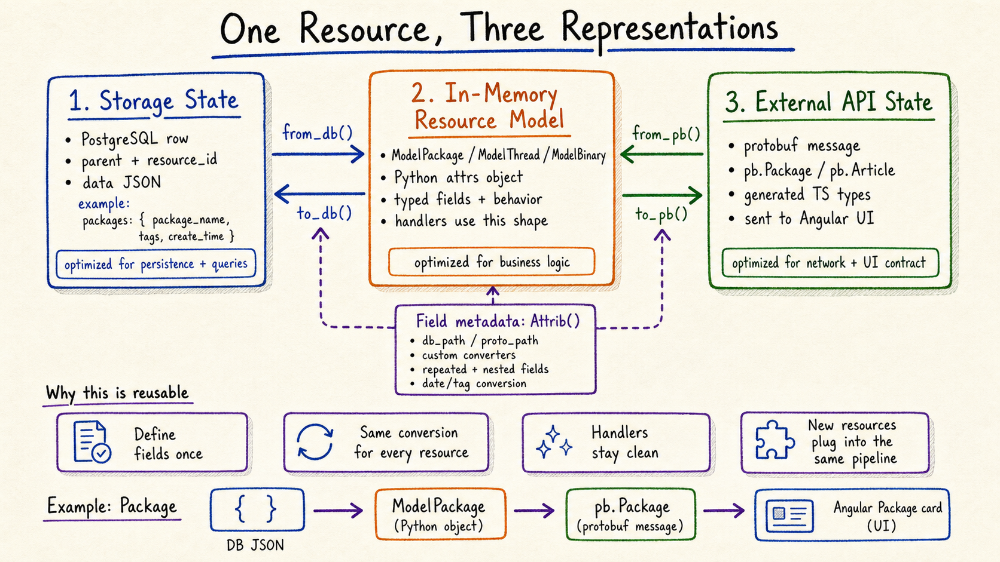
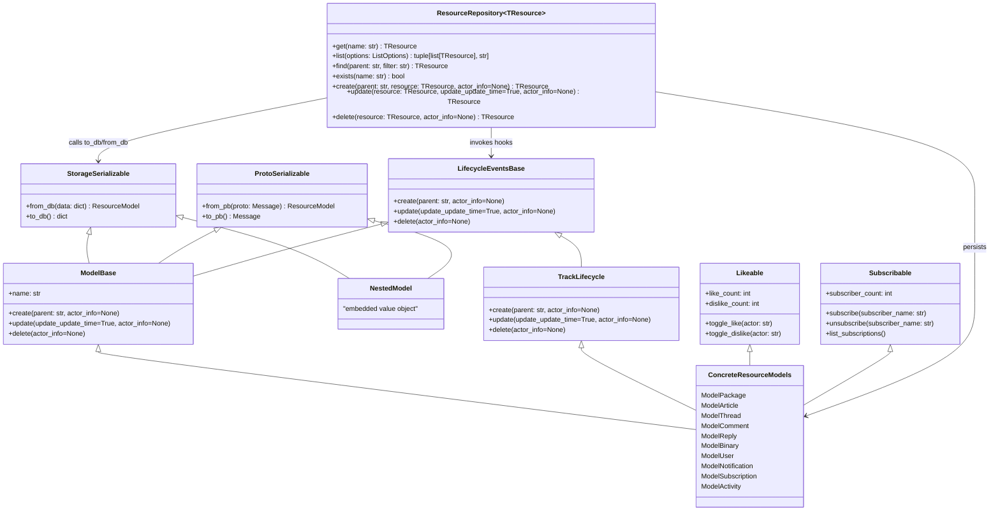

# Resource model

The backend treats each business object as one resource that can exist in three
representations:



## Three representations

### 1. Storage state

This is the shape optimized for persistence. For the newer resource model, rows
are addressed by `parent` and `resource_id`, and the resource body is stored as
structured JSON data.

Example:

```text
parent: categories/1
resource_id: 123
data: {
  "name": "categories/1/packages/123",
  "package_name": "...",
  "tags": [...],
  "create_time": "..."
}
```

The generic storage conversion lives in
[`base_storage.py`](../back-end/src/handler/model/base/base_storage.py).

### 2. In-memory resource model

This is the shape optimized for backend business logic. Handlers work with
Python model objects such as `ModelPackage`, `ModelThread`, `ModelBinary`, and
`ModelArticle`.

The model is more than a data bag. It carries typed fields, resource identity,
conversion metadata, and shared behavior from the base model classes.

Example:

```python
@InitModel(db_table='packages', proto_class=pb.Package)
@attrs.define
class ModelPackage(ModelBase):
    name: str = StrAttrib()
    package_name: str = StrAttrib()
    create_time: datetime.datetime = DatetimeAttrib(...)
    tags: ModelTag = Attrib(..., repeated=True)
```

See [`model_package.py`](../back-end/src/handler/model/model_package.py).

### 3. External API state

This is the shape optimized for the network and frontend contract. The external
form is a protobuf message such as `pb.Package`, `pb.Article`, or `pb.Thread`.
Those protobuf definitions also generate the TypeScript types used by Angular.

The generic protobuf conversion lives in
[`base_proto.py`](../back-end/src/handler/model/base/base_proto.py).

## Class model

The backend model classes are split by responsibility:

- `StorageSerializable` converts between Python objects and storage JSON.
- `ProtoSerializable` converts between Python objects and protobuf messages.
- `LifecycleEventsBase` defines lifecycle hooks that can be extended by behavior
  mixins.
- `ResourceRepository` owns persistence operations and invokes lifecycle hooks.
- Concrete resources compose the reusable serialization bases and optional
  behavior mixins.



`ModelBase` deliberately does not own persistence. It owns resource identity,
serialization, and lifecycle hooks. `ResourceRepository` is the only generic
CRUD boundary for persisted resources.

## How conversion works

Each field is declared once with helpers such as `StrAttrib`, `IntAttrib`,
`DatetimeAttrib`, `NestedAttrib`, or the lower-level `Attrib`.

That field metadata tells the base framework:

- whether the field exists in storage
- whether the field exists in protobuf
- which storage path or protobuf path to use
- which converter handles special values such as dates, tags, nested messages,
  or repeated fields

The important conversion methods are:

- `from_db()`: storage JSON to Python model
- `to_db()`: Python model to storage JSON
- `from_pb()`: protobuf message to Python model
- `to_pb()`: Python model to protobuf message

## Repository boundary

Persistence access is routed through
[`ResourceRepository`](../back-end/src/handler/repository.py). Handlers and
backend utilities should use repositories for `get`, `list`, `find`, `create`,
`update`, and `delete` instead of calling model persistence methods such as
`ModelPackage.from_name()` or `ModelPackage.list()` directly.

That keeps resource models focused on representation, conversion, and lifecycle
behavior while giving the backend a single storage boundary that can later grow
transaction, caching, indexing, or alternate storage behavior.

## Why this is useful

This pattern keeps each resource definition reusable across layers:

- Handlers stay focused on business rules instead of mapping fields by hand.
- Storage and protobuf conversion are consistent for every resource type.
- New resource types can plug into the same pipeline.
- Tests can target the shared conversion contract instead of duplicating setup
  for every handler.

In short: the model is the bridge between storage, backend logic, gRPC, and the
Angular UI.
